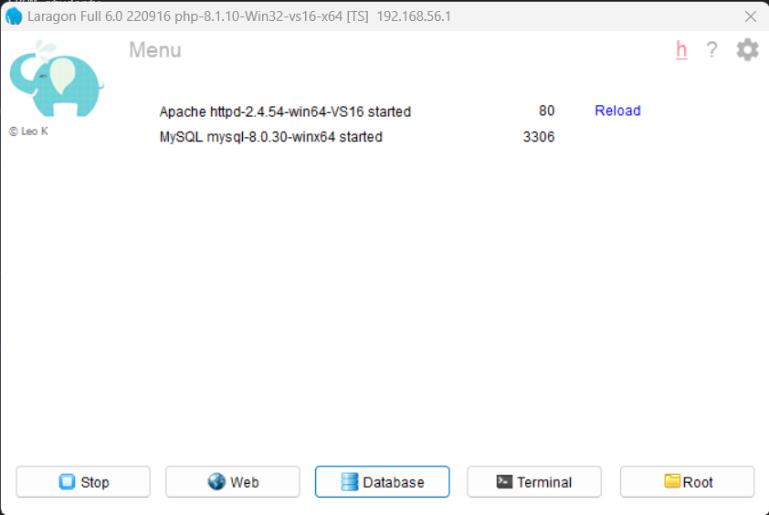
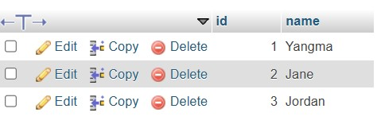

# Labs

## Lab 1: Laragon Setup and MySQL Basics

### Overview
This lab focuses on setting up Laragon as a local development environment and practicing essential MySQL commands.  The objective of this project is to build a database structure while establishing tables followed by data entry and data retrieval through fundamental SQL commands. 

### Setup and Tools
### Environment
**Laragon**: A development environment for PHP, MySQL, and more.  
**phpMyAdmin**: Accessed via Laragon for managing MySQL databases and executing queries.

### Configuration
MySQL Port: 3306
Default Username: root
Password: None (default for Laragon)

### Steps
**1. Installing and Configuring Laragon**
Download Laragon and install it. Starting Laragon and ensure that the Apache and MySQL services are running and open phpMyAdmin by navigating to http://localhost/phpmyadmin in the browser.

**2. Basic MySQL Commands**

**Creating a Database and Table** :Learing and implementing queries to create database,switching to the created database and tables.

**Adding Data to the Table** :Inserting sample records into the table using the `INSERT` command.  

**Querying Data** : Retrieve all records from the table using `SELECT` and filtering data.  

### Basic MySQL Commands

USE iims;

CREATE TABLE student
(
    id INT AUTO_INCREMENT PRIMARY KEY,
    name VARCHAR(255) NOT NULL,
    grade CHAR(1) NOT NULL
);

INSERT INTO student(name, grade) VALUES ('Yangma', 'A'), ('Jane', 'B'), ('Jordan', 'A');

SELECT id, name FROM student;

SELECT id, name FROM student;

SELECT id, name FROM student;

SELECT grade, COUNT(*) FROM student GROUP BY grade;

SELECT DISTINCT grade FROM student;

### Screenshots

Fig: Laragon Setup

FIg: MySQL implementation

---
## Lab 2: MySQL Query Practice

### Overview
This lab focused on enhancing skills in writing effective SQL queries to solve real-world problems using MySQL. I used different case scenarios to practice data filtering techniques together with sorting and grouping while documenting my queries and outcomes to increase my knowledge.

### Setup and Tools
### Environment
**Laragon**: A development environment for PHP, MySQL, and more.  
**phpMyAdmin**: Accessed via Laragon for managing MySQL databases and executing queries.

### Configuration
MySQL Port: 3306
Default Username: root
Password: None (default for Laragon)

### Steps

**1. Filtering Data with Conditions**: Retrieving specific rows based on conditions using 'WHERE' clause helping isolate relevant data from the table. For example, to fetch users whose email contains the domain example.com:

SELECT * FROM Users WHERE Email LIKE `%example.com`;

**2. Sorting and Grouping Data**: Displaying the datas in ascending or decending order and group users using `ORDER BY` and `GROUP BY` respectively.

**3. Solving Query Challenges**:  Fetching Records with Specific Criteria, Counting Rows and Calculating Averages based on conditions.

**4. Using Aggregate Functions**: Summing Data, Maximum Values, and Counting Rows using aggregate functions like `SUM`, `COUNT`, and `MAX` to manipulate and analyze data.  

### Query Practice Questions

CREATE DATABASE school;

USE school;

CREATE TABLE students
(
	id	INT AUTO_INCREMENT PRIMARY KEY,
	name  VARCHAR(255) NOT NULL,
	age   INT      	NOT NULL,
	grade CHAR(1)  	NOT NULL,
	email VARCHAR(255) NOT NULL UNIQUE
);

INSERT INTO students (name, age, grade, email)

VALUES ('Liam', 16, 'B', 'liam1@example.com'),

   	('Ella', 15, 'C', 'ella3@example.com'),

   	('Sophia', 15, 'C', 'sophia3@example.com'),

   	('James', 14, 'C', 'james3@example.com'),

   	('Emma', 17, 'A', 'emma4@example.com'),

   	('Noah', 15, 'C', 'noah@example.com'),

   	('Alexander', 17, 'B', 'alexander@example.com'),

   	('Ella', 16, 'B', 'ella2@example.com'),

   	('Benjamin', 16, 'A', 'benjamin@example.com'),

   	('Sophia', 16, 'A', 'sophia4@example.com'),

   	('Zoe', 15, 'A', 'zoe@example.com'),

   	('Liam', 14, 'A', 'liam4@example.com'),

   	('Scarlett', 14, 'A', 'scarlett@example.com'),

   	('Harper', 17, 'C', 'harper@example.com'),

   	('Emma', 15, 'A', 'emma1@example.com'),

   	('Daniel', 16, 'A', 'daniel@example.com'),

   	('Ella', 17, 'A', 'ella1@example.com'),

   	('Chloe', 14, 'B', 'chloe@example.com'),

   	('Sophia', 16, 'B', 'sophia1@example.com'),

   	('Nathan', 17, 'C', 'nathan@example.com'),

   	('Hannah', 16, 'A', 'hannah@example.com'),
   	('Emma', 16, 'B', 'emma2@example.com'),

   	('Logan', 20, 'A', 'logan@example.com'),

   	('James', 19, 'A', 'james2@example.com'),

   	('Victoria', 15, 'B', 'victoria@example.com');

 **1. Find all students who are 15 years old.**
    SELECT * FROM students WHERE age =15;

 **2. Count how many students received grade 'B'.**
    SELECT grade, COUNT(*) FROM students WHERE grade='B';

 **3. Write a query to find students whose email contains the word "emma".**
    SELECT * FROM students WHERE email like'%emma%';

 **4. Retrieve the details of students who received grade 'A' and sort them by age in descending order.**
    SELECT * FROM students WHERE grade='A' ORDER BY age DESC;

 **5. List the top 3 youngest students by their ages.**
    SELECT * FROM students ORDER BY age ASC LIMIT 3;

 **6. Fetch all students who do not have grade 'C'.**
    SELECT * FROM students WHERE grade !='C';

 **7. Find students whose names are unique in the table (no duplicates).**
    SELECT name, COUNT(name) name_count
    FROM students GROUP BY name HAVING name_count = 1;

 **8. Find the student(s) with the longest or shortest names.**
    SELECT * FROM students LENGTH(name) DESC LIMIT 1;
    SELECT * FROM students LENGTH(name) ASC LIMIT 1;

 **9. Verify whether all students are at least 14 years old.**
    SELECT IF(MIN(age) >= 14, 'Yes', 'No') result
    FROM students;

 **10. Retrieve the second-highest age in the table.**
    SELECT MAX(age) max_age
    FROM students
    WHERE age < (SELECT MAX(age) FROM students);

 **11. Find students who share both the same grade and age.**
    SELECT grade, age, COUNT(*) pair_count
    FROM students
    GROUP BY grade, age
    HAVING pair_count>1;

 **12. Calculate the percentage of students in each grade.**
    SELECT grade, ROUND(COUNT(*)/ (SELECT COUNT(*) FROM students) * 100, 2) percentage
    FROM students
    GROUP BY grade;

### Screenshots

Fig: QueriesOutput

Fig: QueriesOutput

Fig: QueriesOutput

Fig: QueriesOutput

---

## Lab 3: Introduction to MVC

### Overview
This lab introduces the Model-View-Controller (MVC) architecture, a fundamental design pattern in web development. The lab explores how MVC separates application concerns into three interconnected components: Model, View, and Controller, to create well-organized and maintainable code.

### Setup and Tools
### Environment
**PHP with Laragon**: Environment Used for local development and to structure the MVC example project. 

### Steps

**1. Understanding MVC Components**

The MVC architecture organizes code into three main components:

**Model**: Handles the data and database interactions. It is responsible for retrieving, storing, and managing application data.

**View**: Manages the presentation layer, displaying data to users using HTML and CSS.

**Controller**: Acts as an intermediary between the Model and View, handling user input and application logic.

The structural separation leads to improved program clarity while also enabling scalability and easier web application maintenance.

**2. Setting Up the MVC Project Structure**

Create folders and subdirectories for models, views, and controllers structure the project.

**3. Building a Simple MVC Example**

**Model** :Simple PHP code serves as the simulator for data retrieval processes.

**Controller** :The model transmits processed data to a view via the logical component.

**View**: The display occurs through a PHP file.

**4. Mock-Up Data and Partials**
In this lab, mock data was used to simulate real-world scenarios. The structure and interactions between the Model, View, and Controller illustrate how the MVC pattern simplifies project development and maintenance.

### Screenshots

Fig:MVC Hierarcy

Fig:MockData

---
## Lab4: Connecting PHP to MySQL

### Overview
The lab demonstrates PHP application connection establishment to MySQL database through MySQLi and PDO. The lab demonstrates the need to safely store authentication credentials along with testing database access functionality.

### Setup and Tools
### Environment
**PHP with Laragon**: Utilized for setting up the local server and running PHP scripts.
**MySQL**: Database to store and manage data.

### Steps

**1. Understanding MySQLi and PDO**:

**MySQLi**
 MySQLi provides a procedural and object-oriented interface which supports only MySQL databases.

**PDO (PHP Data Objects)**
PDO offers an object-oriented interface and supports multiple database types. PDO is recommended for portability across different databases.

**2. Writing a Basic Connection Script**: Write the basic structure code to connect to a database, including error handling.

**3. Testing Database Connectivity**: Create a database in MySQL and Run the scripts to verify if the database connection is sucessful. 

**4. Securing Database Credentials**: Learning to use environment variables store credentials in the database securely.

### Screenshots

Fig: Connecting PHP to MySQL

---
## Lab 5: Create  and Read Operation in PHP with MySQL

### Overview
This lab implement the "Create" functionality in PHP to insert data into the MySQL database efficiently and accurately.

### Setup and Tools
### Environment
**PHP with Laragon**: Utilized for setting up the local server and running PHP scripts.
**MySQL**: Database to store and manage data.

### Steps

**1. Create the Input Form**: Create an HTML form that accepts user inputs including submit button.

**2. Capture and Validate Input Data in PHP**: Use PHP to to retrieve and validate the input data.

**3. Insert Data into the Database**: Connect to the database using MySQLi and Use an `INSERT` query to add the data.

**4. Test the Functionality**: Open the form and test the data are added correctly into the database through the form and displayed accurately.

### Screenshots

---
## Lab 6: Update and Delete Operations in PHP with MySQL

### Overview
This lab encompases the "Update" and "Delete" functionalities to manage records in the MySQL database using PHP. 

### Setup and Tools
### Environment
**PHP with Laragon**: Utilized for setting up the local server and running PHP scripts.
**MySQL**: Database to store and manage data.

 ### Steps

 **1. Update Existing Records**: Create a pre-filled HTML form for editing records with a update button and include a hidden input field to pass the record ID.

 **2. Deleting Records**: Create a delete button with a confirmation dialog. 

**3. Test the Update and Delete Functionalities**: Perform the operations in each forms in PHP and verify the operations are handled correctly.

### Screenshots

